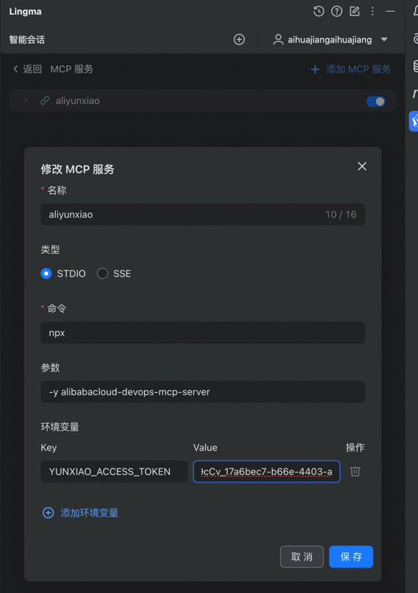
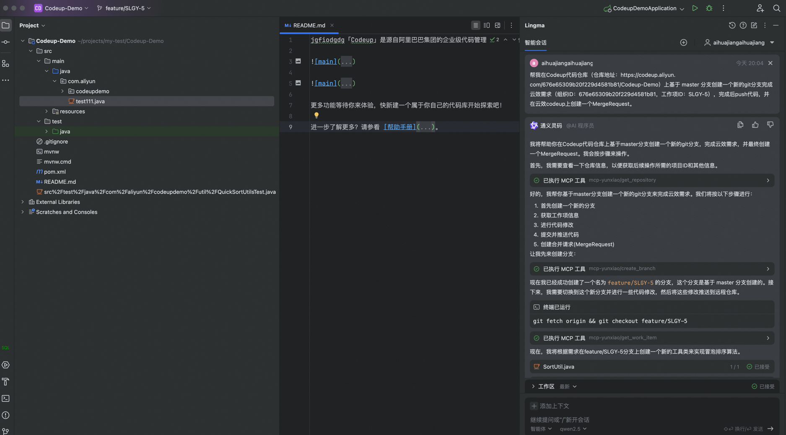
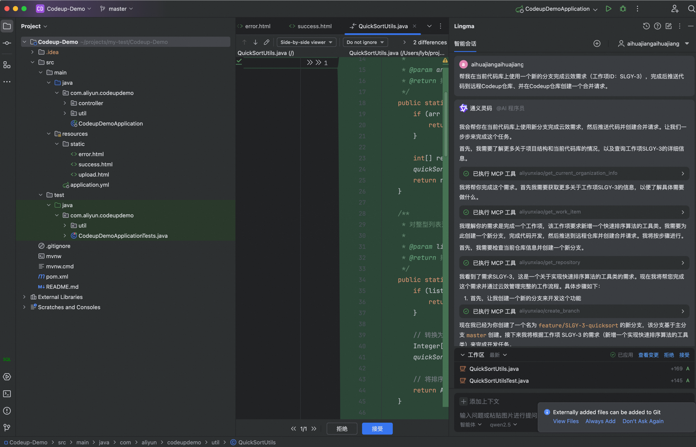
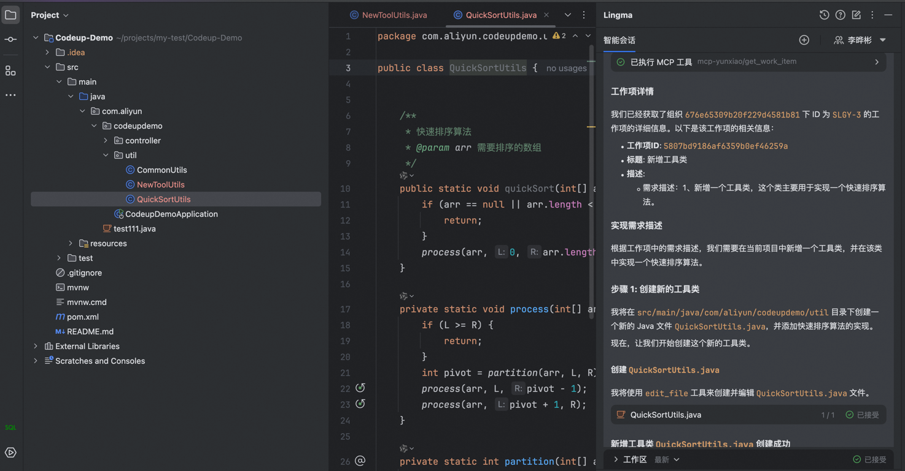
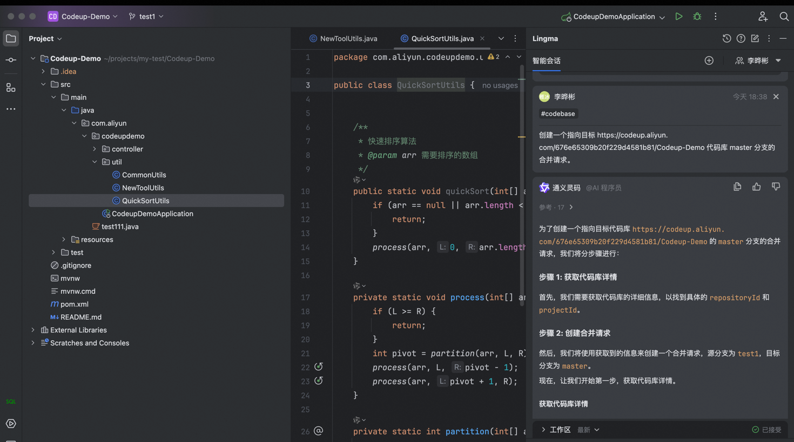
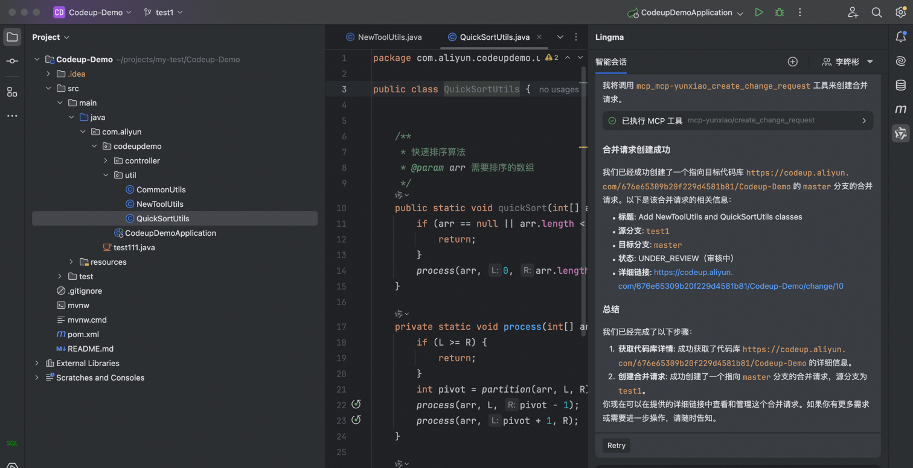
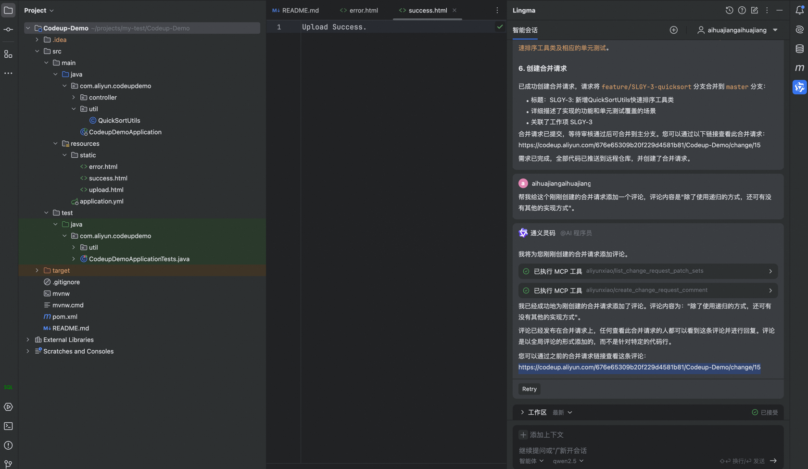
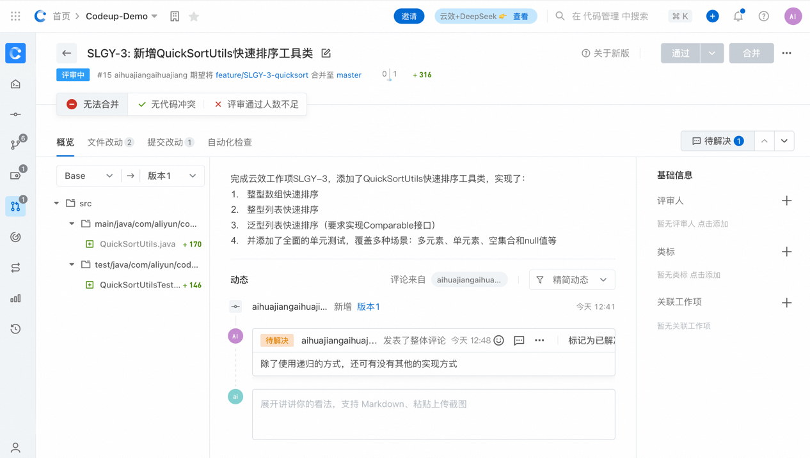

# alibabacloud-devops-mcp-server

alibabacloud-devops-mcp-server(云效mcp-server)是一个为阿里云云效平台构建的API集成工具。该工具基于模型上下文协议(Model Context Protocol，MCP)协议]，为 AI 助手提供了与云效平台交互的能力，能够让 AI 助手深入理解项目、工作项、代码库、Merge Request，并直接参与研发协作，帮助团队优化开发流程、提升效率。alibabacloud-devops-mcp-server 可以让 AI 助手可以读取项目中工作项的内容、理解需求，自动编写代码和执行代码管理任务，并提交合并请求等。

企业研发团队可以使用它协助代码审查、优化任务管理、减少重复性操作，从而专注于更重要的创新和产品交付。

## 功能特性

alibabacloud-devops-mcp-server提供了以下功能，让AI助手能够：

* **代码仓库管理**：查询代码仓库及其分支、创建分支
* **文件操作**：创建、更新、删除和获取代码文件内容
* **代码评审**：创建和管理代码评审流程
* **项目管理**：搜索项目、获取项目详情

## 工具列表

alibabacloud-devops-mcp-server集成了多种工具，包括：

### 组织
- `get_current_organization_Info`: 获取当前用户所在组织信息
- `get_user_organizations`: 获取当前用户加入的组织列表

### 代码管理工具

- `create_branch`: 创建分支
- `delete_branch`: 删除分支
- `get_branch`: 获取分支信息
- `list_branches`: 获取分支列表
- `create_file`: 创建文件
- `delete_file`: 删除文件
- `get_file_blobs`: 获取文件内容
- `list_files`: 查询文件树
- `update_file`: 更新文件内容
- `create_change_request`: 创建合并请求
- `create_change_request_comment`: 创建合并请求评论
- `get_change_request`: 查询合并请求
- `list_change_request_patch_sets`: 查询合并请求版本列表
- `list_change_request`: 查询合并请求列表
- `list_change_request_comments`: 查询合并请求评论列表
- `get_compare`: 代码比较
- `get_repository`: 获取仓库详情
- `list_repositories`: 获取仓库列表

### 项目管理工具

- `get_project`: 获取项目详情
- `search_projects`: 搜索项目
- `get_work_item`: 获取工作项详情
- `search_workitems`: 搜索工作项

## 用法

### 先决条件
* 阿里云云效个人访问令牌，[点击前往](https://help.aliyun.com/zh/yunxiao/developer-reference/obtain-personal-access-token?spm=a2c4g.11186623.help-menu-150040.d_5_0_1.5dc72af2GnT64i)，尽量赋予所有api读写权限。

### 通过 NPX 运行 MCP 服务器
```json
{
  "mcpServers": {
    "yunxiao": {
      "command": "npx",
      "args": [
        "-y",
        "alibabacloud-devops-mcp-server"
      ],
      "env": {
        "YUNXIAO_ACCESS_TOKEN": "<YOUR_TOKEN>"
      }
    }
  }
}
```
### 通过 Docker 容器运行 MCP 服务器
1.Docker build
```shell
docker build -t alibabacloud/alibabacloud-devops-mcp-server .
```
2.配置 MCP 服务器
```json
{
  "mcpServers": {
    "yunxiao": {
      "command": "docker",
      "args": [
        "run",
        "-i",
        "--rm",
        "-e",
        "YUNXIAO_ACCESS_TOKEN",
        "alibabacloud/alibabacloud-devops-mcp-server"
      ],
      "env": {
        "YUNXIAO_ACCESS_TOKEN": "<YOUR_TOKEN>"
      }
    }
  }
}
```
## 使用体验（以在通义灵码中使用为例）
1.本地配置




配置成功后如下：



2.让模型调用MCP服务器完成云效需求并创建合并请求







